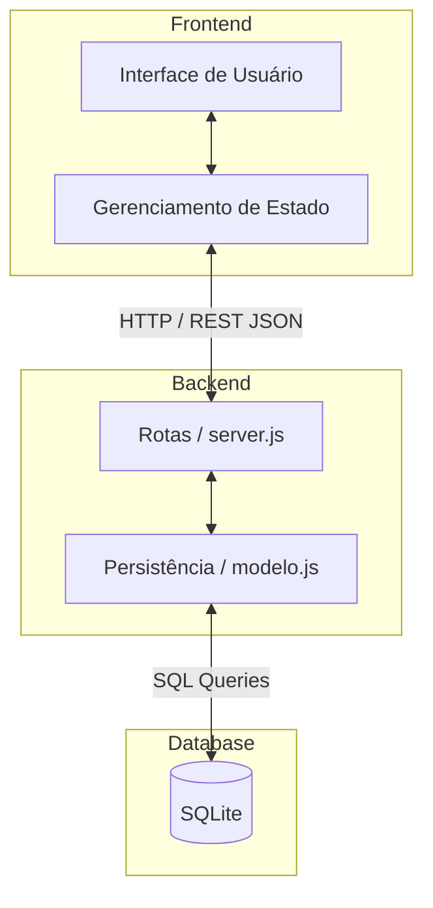

# Análise Arquitetural do Sistema Atual

## a) Identificação da Arquitetura

1. **Estilo Arquitetural:** 
   O sistema ESM Forum segue o estilo **Cliente-Servidor (Client-Server)** com comunicação baseada em **API RESTful**. O frontend e o backend estão fisicamente e logicamente separados em repositórios distintos, caracterizando uma arquitetura de sistemas distribuídos simples.

2. **Camadas Existentes (Backend):**
   Atualmente, o backend não possui uma arquitetura de camadas (Layered Architecture) rígida. A estrutura divide-se essencialmente em duas partes:
   - **Camada de Apresentação/Controle:** O arquivo `server.js` atua recebendo as requisições HTTP, servindo de roteador e controlador simultaneamente.
   - **Camada de Dados:** O arquivo `modelo.js` (apoiado por `bd_utils.js`) concentra toda a persistência de dados e algumas regras de negócio misturadas (como contagem de respostas).
   - *Nota: A camada de Negócio (Business/Service) é praticamente inexistente, exceto pela refatoração feita na iteração 1 com o `BuscaService`.*

3. **Comunicação Frontend-Backend:**
   A comunicação é feita de forma síncrona através do protocolo HTTP. O frontend (React) faz requisições (`GET`, `POST`) utilizando APIs padrão (como `fetch` ou `axios`), e o backend (Node.js/Express) processa e devolve os dados estritamente no formato **JSON**.

## b) Diagrama Arquitetural

