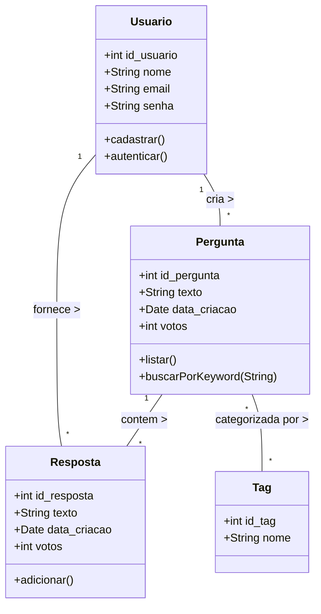
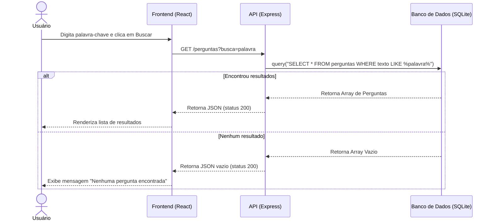
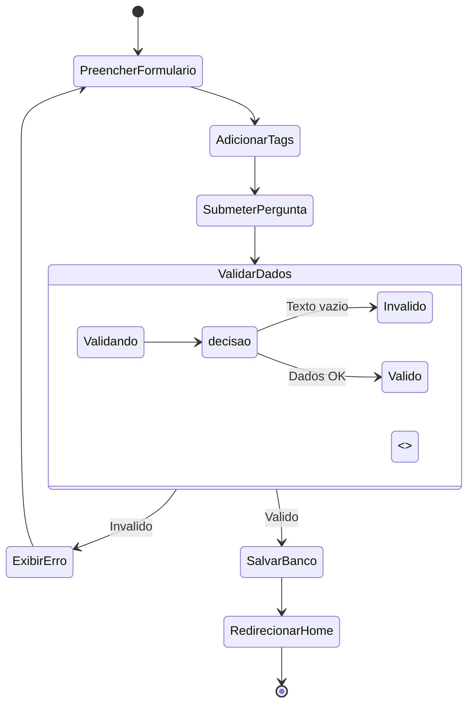
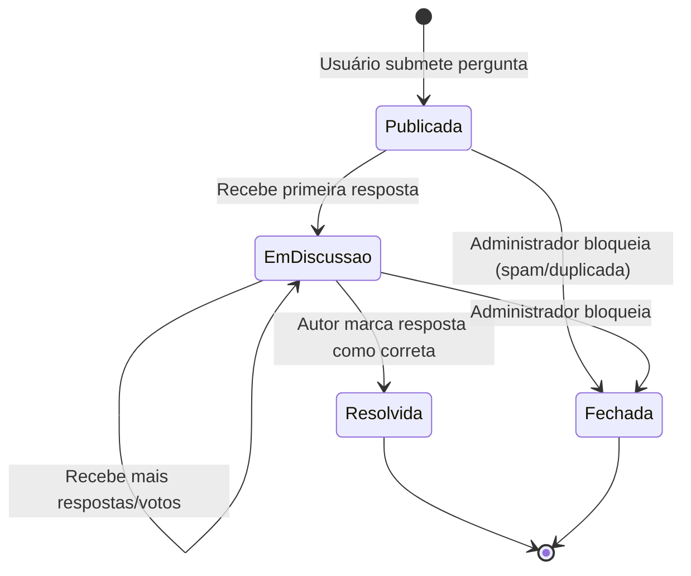

#### a) Diagrama de Classes

#### b) Diagrama de Sequência (Busca de Perguntas)

#### c) Diagrama de Atividades (Criar Pergunta com Tag)

#### d) Diagrama de Estados (Ciclo de vida de uma Pergunta)

