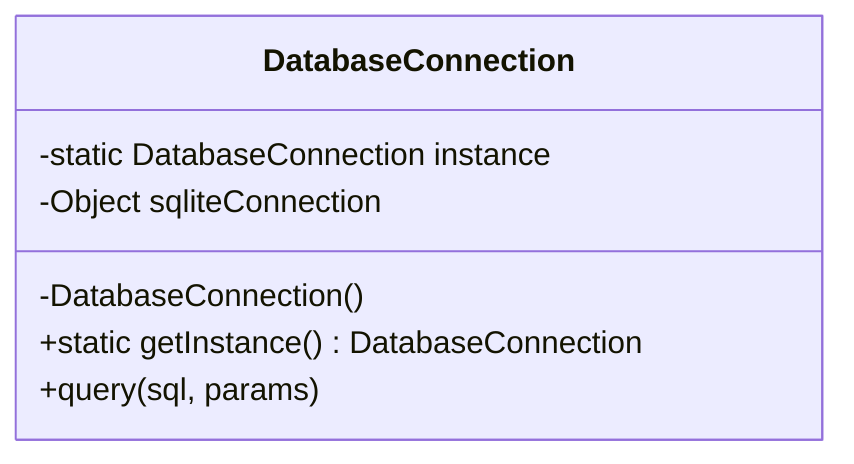
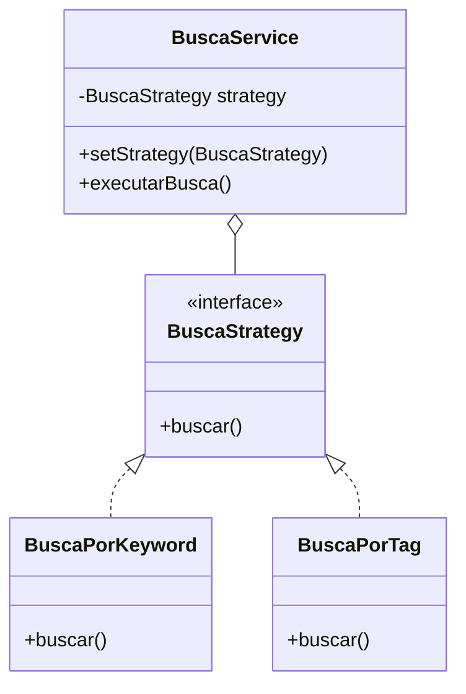
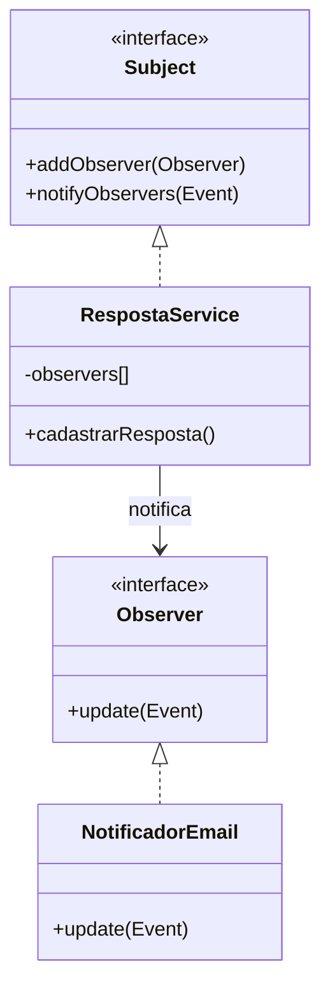

# Proposta de Aplicação de Padrões de Projeto

## 1. Padrão Criacional: Singleton

**a) Justificativa e Contexto**
- **Funcionalidade:** Conexão com o banco de dados SQLite.
- **Problema:** Abertura de múltiplas conexões concorrentes com o banco de dados pode causar *locks* no SQLite (database is locked) e consumo excessivo de recursos.
- **Adequação:** O Singleton garante que a classe de banco de dados tenha apenas uma única instância durante todo o ciclo de vida da aplicação Node.js.

**b) Proposta de Solução**
Criar uma classe `DatabaseConnection` com construtor privado (emulando no JS) e um método estático `getInstance()`. Qualquer repositório que precisar acessar o banco chamará este método estático em vez de instanciar o `bd_utils` diretamente.

**Diagrama de Classes:**


**c) Exemplo de Código (Pseudo-código JS):**
```javascript
class DatabaseConnection {
    constructor() {
        if (DatabaseConnection.instance) {
            return DatabaseConnection.instance;
        }
        this.sqliteConnection = inicializarSQLite();
        DatabaseConnection.instance = this;
    }

    static getInstance() {
        return new DatabaseConnection();
    }
}
// Uso: const bd = DatabaseConnection.getInstance();
```

---

## 2. Padrão Comportamental: Strategy

**a) Justificativa e Contexto**
- **Funcionalidade:** Busca de perguntas (Palavra-chave vs Categoria/Tag).
- **Problema:** À medida que adicionamos novos filtros (buscar por autor, por tag, por data), o nosso `BuscaService` ficaria cheio de estruturas `if/else`, violando o Open/Closed Principle.
- **Adequação:** O Strategy permite encapsular cada algoritmo de busca em uma classe própria. O contexto (o serviço) apenas delega a execução para a estratégia escolhida.

**b) Proposta de Solução**
Criar uma interface/classe base `BuscaStrategy` com o método `buscar()`. Implementar as classes concretas `BuscaPorKeyword` e `BuscaPorTag`. O controlador instanciará a estratégia correta dependendo dos parâmetros da URL e passará para o `BuscaService`.

**Diagrama de Classes:**


**c) Exemplo de Código (Pseudo-código JS):**
```javascript
// Estratégia
class BuscaPorKeyword {
    buscar(repositorio, termo) {
        return repositorio.query("SELECT * FROM perguntas WHERE texto LIKE ?", [`%${termo}%`]);
    }
}

// Contexto
class BuscaService {
    constructor(strategy) { this.strategy = strategy; }
    executarBusca(repositorio, parametro) {
        return this.strategy.buscar(repositorio, parametro);
    }
}
// Uso: const service = new BuscaService(new BuscaPorKeyword());
```

---

## 3. Padrão Comportamental: Observer

**a) Justificativa e Contexto**
- **Funcionalidade:** Notificação de novas respostas às suas perguntas.
- **Problema:** O fluxo de criar uma resposta não deve ficar acoplado à lógica complexa de enviar emails ou notificações push. Se fizermos isso de forma síncrona, a API ficará lenta.
- **Adequação:** O Observer cria um modelo de assinatura (Pub/Sub). A entidade `RespostaService` atua como *Subject* e notifica todos os *Observers* inscritos (como `EmailNotifier`) sempre que uma nova resposta é criada, mantendo o baixo acoplamento.

**b) Proposta de Solução**
Criar um `EventManager` ou Subject no serviço de respostas. Quando `cadastrar_resposta` for concluído com sucesso, ele dispara um evento `nova_resposta`. A classe `EmailNotificationObserver` estará escutando este evento para disparar a notificação ao autor da pergunta.

**Diagrama de Classes:**


**c) Exemplo de Código (Pseudo-código JS):**
```javascript
class RespostaService {
    constructor() { this.observers = []; }
    
    addObserver(observer) { this.observers.push(observer); }
    
    cadastrarResposta(id_pergunta, texto) {
        const resposta = db.inserir(id_pergunta, texto);
        // Notifica os interessados sem se importar com o que farão
        this.observers.forEach(obs => obs.update({ tipo: 'NOVA_RESPOSTA', dados: resposta }));
        return resposta;
    }
}

class NotificadorEmail {
    update(evento) {
        if(evento.tipo === 'NOVA_RESPOSTA') {
            EmailService.enviar(evento.dados.autor, "Você tem uma nova resposta!");
        }
    }
}
```