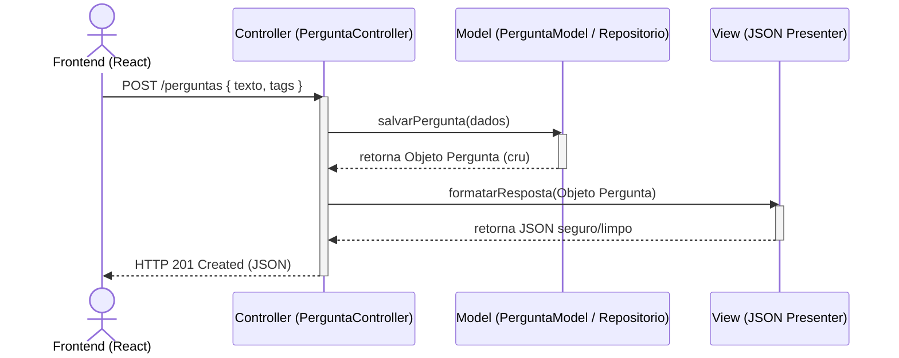

# Proposta de Organização Arquitetural

## a) Proposta de Separação em Camadas (Layered Architecture)

Para resolver o alto acoplamento atual, o backend deve ser reorganizado em três camadas estritas. Uma camada só pode comunicar com a camada imediatamente abaixo dela.

1. **Camada de Apresentação (Controllers/Routes)**
   - **Responsabilidade:** Receber a requisição HTTP, validar os parâmetros de entrada (payload/query), chamar o serviço adequado e retornar a resposta JSON com o HTTP Status Code correto (200, 201, 400, 500).
   - **Exemplo:** `PerguntaController.js`.
   - **Comunicação:** Recebe do Client, envia para a Camada de Negócio.

2. **Camada de Negócio (Services)**
   - **Responsabilidade:** Conter todas as regras de negócio da aplicação. É aqui que validamos se um usuário pode votar duas vezes, se uma pergunta tem tags válidas, etc.
   - **Exemplo:** `PerguntaService.js`, `VotoService.js`.
   - **Comunicação:** Recebe do Controller, envia para a Camada de Dados.

3. **Camada de Dados (Repositories)**
   - **Responsabilidade:** Isolar a lógica de acesso ao banco de dados (SQL). Nenhuma regra de negócio deve existir aqui. Se mudarmos do SQLite para PostgreSQL amanhã, apenas esta camada sofre alterações.
   - **Exemplo:** `PerguntaRepository.js`.
   - **Comunicação:** Recebe do Service, interage com o SGBD.

---

## b) Proposta de Aplicação do Padrão MVC

O padrão MVC (Model-View-Controller) pode ser perfeitamente adaptado para a nossa API REST:

1. **Models (Modelos):** Representam as entidades de dados e as suas validações. Teríamos `PerguntaModel` e `RespostaModel`. Eles validam os tipos de dados (ex: o texto da pergunta não pode ser nulo).
2. **Views (Visões):** Numa API REST, não temos HTML. A "View" é a formatação do JSON (Presenters). Criaremos formatadores para garantir que senhas de usuários ou dados sensíveis nunca sejam enviados na resposta JSON.
3. **Controllers (Controladores):** Orquestram o fluxo. Um `RespostasController` receberia o POST de uma nova resposta, pediria ao Model para salvar e utilizaria a View para devolver o JSON formatado.

### Funcionalidades escolhidas para o MVC:
- **Funcionalidade 1:** Criação de Nova Pergunta.
- **Funcionalidade 2:** Listagem de Respostas de uma Pergunta.

### Diagrama da Estrutura MVC Proposta

